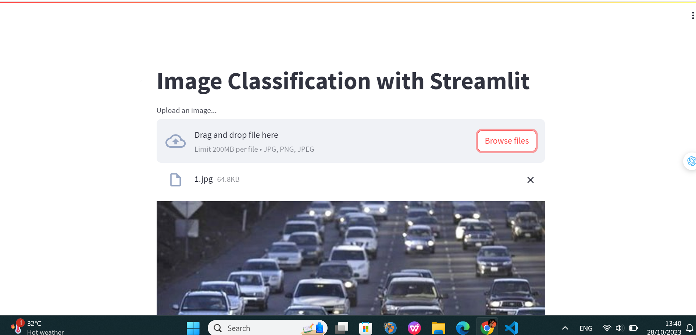

<!-- TABLE OF CONTENTS -->
<details>
  <summary>Table of Contents</summary>
  <ol>
    <li>
      <a href="#about-the-project">About The Project</a>
    </li>
    <li>
      <a href="#getting-started">Getting Started</a>
      <ul>
        <li><a href="#prerequisites">Prerequisites</a></li>
      </ul>
    </li>
    <li><a href="#usage">Usage</a></li>
    <li><a href="#contact">Contact</a></li>
    <li><a href="#acknowledgments">Acknowledgments</a></li>
  </ol>
</details>


<!-- ABOUT THE PROJECT -->
## About The Project



This is a mini project to implement Yolov5m to detect 5 objects: bicycle, bus, car, motorbike, person. 

Here's overview of the project:
* You run the app and input an image contains the objects above. 
* Model will return the bounding box, class name and number of objects per class. 

Use the `only_streamlit.py` to get started.


<!-- GETTING STARTED -->
## Getting Started

This is an example of how you may give instructions on setting up your project locally.
To get a local copy up and running follow these simple example steps.

### Prerequisites
You need to install these packages

* streamlit
  ```sh
  pip install streamlit
  ```
* fastapi
  ```sh
  pip install fastapi
  ```
* onnxruntime
  ```sh
  pip install onnxruntime
  ```

<!-- USAGE EXAMPLES -->
## Usage

Use this space to show useful examples of how a project can be used. Additional screenshots, code examples and demos work well in this space. You may also link to more resources.

1. Clone the repo
   ```sh
   git clone https://github.com/huyhoanlee/AIO_Yolov5m.git
   ```
   In this repo, I already push the "best.onnx" file (contains model's weight). 
   Path: models/best.onnx
2. To use `only_streamlit.py` 
   ```sh
   streamlit run only_streamlit.py
   ```
3. To use API in `fastapi.py`
   ```sh
   uvicorn fastapi:app --port 8000
   ```

<!-- CONTACT -->
## Contact

Le Huy Hoan - hoanle2003@gmail.com

Project Link: [https://github.com/huyhoanlee/AIO_Yolov5m.git](https://github.com/huyhoanlee/AIO_Yolov5m.git)


<!-- ACKNOWLEDGMENTS -->
## Acknowledgments

Below is a list of resources that I used to implement this project 

* [Yolov5m traning notebook](https://www.kaggle.com/code/hoanlez/l8-yolov5-training/edit)
* [Yolov5m inference notebook](https://www.kaggle.com/code/hoanlez/l9-yolov5-inference/edit)
* [Yolov5m Config](https://github.com/ultralytics/yolov5/blob/master/models/yolov5m.yaml)
* [Neutron to visualize model](https://netron.app/)

